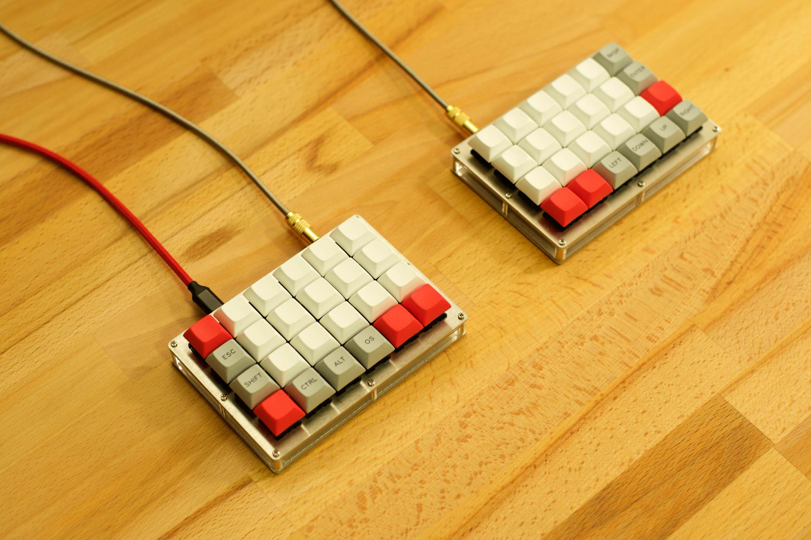

# Dalsik

This document describes the implementation details of this software for the Let's Split keyboard.

## Overview

Let's Split is a split keyboard, meaning that it has two sides: master (connected via a USB cable with the PC) and slave. Each side has it's own microcontroller (MCU), which is used mainly to detect changes in pressed/released keys. The two halves are connected via a TRRS cable (power + data transfer). The slave side sends its key events to the master side. The master side is responsible for sending the USB HID Report data via the USB cable based on the detected key events on the master side and the received key events from the slave side. The mapping of physical keys to key codes is stored on the master side in its EEPROM.

## Detailed documentation

* [Microcontroller basics](microcontroller_basics.md)
* [Keyboard wiring](keyboard_wiring.md)
* [Matrix scanning](matrix_scan.md)
* [Master & Slave](master_slave.md)
* [USB HID Structure](usb_hid.md)
* [Key Types and features](key_types.md)
* [EEPROM layout](eeprom_layout.md)
* [SerialCommand](serial_command.md)
* [KeyMap](keymap.md)
* [SlaveReport](slave_report.md)
* [MasterReport](master_report.md) - TODO

