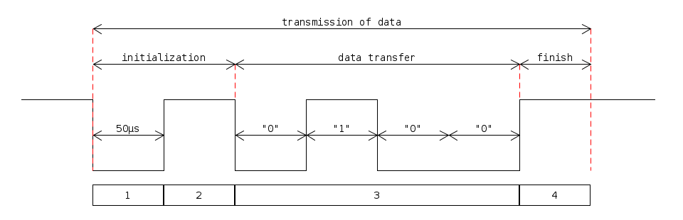

# Master & Slave


The Let's Split keyboard consists of two halves:

* master
* slave

The master half is the one, which is connected via an USB cable with the computer. This half is responsible to report the key press/release events to the operating system. The slave half is responsible for scanning its own key matrix and for reporting any changes to the master via the TRRS cable.

## Master election

Each side decides independently if it is going to run as master or slave in the `setup()` function:

```c++
// dalsik.ino

uint8_t is_master = 0;

void setup() {
    delay(100);
    if (usb_connected()) {
		is_master = 1;
    }
    delay(100);

    if (is_master) {
        DalsikSerial::master_init();
    } else {
        DalsikSerial::slave_init();
    }
}

uint8_t usb_connected() {
   USBCON |= (1 << OTGPADE); //enables VBUS pad
   delayMicroseconds(5);
   return (USBSTA & (1 << VBUS)); //checks state of VBUS
}
```

The master and the slave communicate with each other via a single-wire serial protocol. The master side initializes its pin for input (`DalsikSerial::master_init()`), while the slave configures its pin for output (`DalsikSerial::slave_init()`).

## Master-Slave communication

The communication between the two halves is one-directional. It is always the slave side, which is sending it's changes to the master side.

Modules:

* [dalsik_serial.h](https://github.com/DavsX/dalsik/blob/master/dalsik_serial.h)
* [dalsik_serial.ino](https://github.com/DavsX/dalsik/blob/master/dalsik_serial.ino)
* [ring_buffer.h](https://github.com/DavsX/dalsik/blob/master/ring_buffer.h)
* [ring_buffer.ino](https://github.com/DavsX/dalsik/blob/master/ring_buffer.ino)

## DalsikSerial::slave_init()

```c++
// dalsik_serial.ino
void DalsikSerial::slave_init(void) {
    PinUtils::pinmode_output_high(SERIAL_PIN);
}
```

The slave side configures it's pin to output with the default value of _high_ (because of the pull-up resistor, which is used on the master side).

## DalsikSerial::master_init()

```c++
// dalsik_serial.ino
void DalsikSerial::master_init(void) {
    PinUtils::pinmode_input_pullup(SERIAL_PIN);
    serial_set_interrupt();
}

inline static void serial_set_interrupt() {
    // Enable INT0
    EIMSK |= _BV(INT0);
    // Trigger on falling edge of INT0
    EICRA |=  (1 << ISC01);
    EICRA &= ~(1 << ISC00);
}
```

The master side initializes it's port for input using a pull-up resistor. Once again during idle state the pin's state is _high_, which corresponds to logical "0".

How is tha master side able to detect, that the slave side is sending data? Using an interrupt. An interrupt stops the current code and starts executing the interrupt handler. The interrupt is set up in the `serial_set_interrupt()` function on the falling edge of the `INT0` interrupt vector, which corresponds to the `PIN_D(0)` pin:

```c++
// dalsik_serial.h
#define SERIAL_PIN PIN_D(0)
```

The serial pin is idling on _high_ signal. Anytime this signal falls to _low_, the interrupt handler of the master side is executed:

```c++
// dalsik_serial.ino
ISR(SERIAL_PIN_INTERRUPT) {
    uint8_t slave_data = serial_master_read();
    DalsikSerial::serial_buffer.append_elem(slave_data);
    // Clear pending interrupts for INTF0 (which were registered during serial_master_read)
    EIFR |= (1 << SERIAL_PIN_INTERRUPT_FLAG);
}
```

The master does 3 things in the interrupt handler:

* read 1 byte of information from the slave side
* add this byte to the `DalsikSerial::serial_buffer` ring buffer
* clear the "interrupt flag", which triggers the interrupt handler. This must be cleared, because it is set during format data transfer, when the signal on the `SERIAL_PIN` goes from _high_ to _low_.

## Master - Slave communication




When the slave side wants to transmit data to the master side, these things happen:

* each "bit" is transmitted during `SERIAL_DELAY` microseconds (50μs)

* the slave side pulls the serial signal to _low_ (`PinUtils::set_output_low(SERIAL_PIN)`) (Phase 1)

  * this triggers the interrupt handler on the master side

* after 50μs the slave sets the signal to _high_ for another 50μs (this is the initialization part) (Phase 2)

* when the master fires its interrupt handler, it tries to synchronize with the slave by starting a loop, which runs, until the signal is _low_ (`while (!PinUtils::read_pin(SERIAL_PIN))`) - (Phase 1)

  * when the slave sets the signal to _high_ (Phase 2), then the master exits its loop

* Then the master waits for 50μs for the end of Phase 2, when the actual data transfer occurs

* There are only 4 bits transmitted on the image above (Phase 3), but in reality there is always 1 bytes (8 bits) send

* The master does not start reading from the pin right away, but instead waits for another 25μs, so that it gets to the middle of the bit transmission, where the signal is not changing. Then it starts reading a bit, waits for 50μs, reads another bit etc.

* The actual data transfer on the slave side is as follows:

  * The most significant bit (MSB) is transmitted first.
  * If the bit is 1, the output is set to _high_ (`PinUtils::set_output_high(SERIAL_PIN)`)
  * If the bit is 0, the output is set to _low_ (`PinUtils::set_output_low(SERIAL_PIN)`)
  * Each bit is transmitted for 50μs

* After sending the data the slave sets the output to _high_ (to its idle state) and waits for 50μs (Phase 4)

  * this additional delay gives time for the master to put the data to the RingBuffer and to reset its interrupt vector

  

```c++
// dalsik_serial.ino

void DalsikSerial::slave_send(uint8_t data) {
    // Trigger the interrupt on the master & send the init LOW/HIGH
    PinUtils::set_output_low(SERIAL_PIN);
    serial_delay();
    PinUtils::set_output_high(SERIAL_PIN);
    serial_delay();

    // Send data - MSB
    for (int8_t i = 7; i >= 0; i--) {
        if (data & (1 << i)) {
            PinUtils::set_output_high(SERIAL_PIN);
        } else {
            PinUtils::set_output_low(SERIAL_PIN);
        }
        serial_delay();
    }

    // Pull the line HIGH - IDLE
    PinUtils::set_output_high(SERIAL_PIN);
    serial_delay();
}

inline static uint8_t serial_master_read() {
    serial_half_delay();
    // Sync to the end of slave LOW
    while (!PinUtils::read_pin(SERIAL_PIN));
    // Wait till the HIGH signal
    serial_delay();
    // Get to the middle of the data signal
    serial_half_delay();

    uint8_t data = 0;

    // Receive data - MSB
    for (uint8_t i = 0; i < 8; i++) {
        data = (data << 1) | PinUtils::read_pin(SERIAL_PIN);
        serial_delay();
    }

    return data;
}
```

## RingBuffer

The data read from the slave side is written into a RingBuffer of size 10 from the `DalsikSerial` module. This  data is the processed later on.

At the beginning I was using just a single `uint8_t` as a buffer, but soon I experienced some bugs. If the slave sent too much data too fast (pressing/releasing of multiple keys with multiple fingers), then sometimes some events in the buffer were overridden by new data before they could be processed. This cause the master side to miss the "The key E was released" event, so a key got stuck.

I chose the size of 10, because the slave side is intended to be used with 1 hand, so the press and sudden release of a key with each finger results in 10 events.

The RingBuffer is implemented over a single array of 10 `uint8_t`s with separate variables for the `read_index`, `write_index` and `size` (number of actual unprocessed bytes in the RingBuffer).

The `read_index` variable holds the index of the array, from where we should read a byte, if the `size` > 0.

```c++
// ring_buffer.ino
uint8_t RingBuffer::has_data() {
    return this->size;
}
```

After reading a byte, the `read_index` is incremented and the `size` variable is atomically decreased.

```c++
// ring_buffer.ino
// Called from main loop
uint8_t RingBuffer::get_next_elem() {
    uint8_t elem = this->buffer[ this->read_index ];
    this->read_index = (this->read_index + 1) % BUFFER_LENGTH;
    ATOMIC_BLOCK(ATOMIC_FORCEON) {
        this->size--;
    }
    return elem;
}
```

The atomic block around `this->size--;` is needed, because this line of code results in three instructions:

* fetch the current value from SRAM into a register
* decrement the value of the register
* write the value to SRAM

This sequence can be at any time interrupted by the interrupt handler, which causes data races, because in the interrupt handler we read a byte from slave and put it in the RingBuffer, while incrementing the `size` variable:

```c++
// Called from ISR
void RingBuffer::append_elem(uint8_t elem) {
    if (this->size >= BUFFER_LENGTH) {
        return;
    }
    this->buffer[ this->write_index ] = elem;
    this->write_index = (this->write_index + 1) % BUFFER_LENGTH;
    this->size++;
}
```

Note, that the `this->size++;` statement is not wrapped in an atomic block, as it already runs in an interrupt handler (which can not be interrupted by anything else).

Also note, that if the RingBuffer is full, we simply drop the data (which is bad, but in practice it never happened to me).