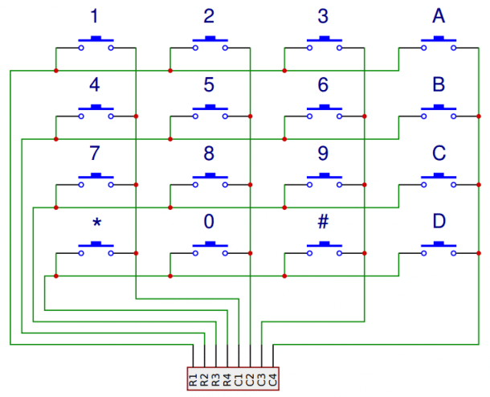
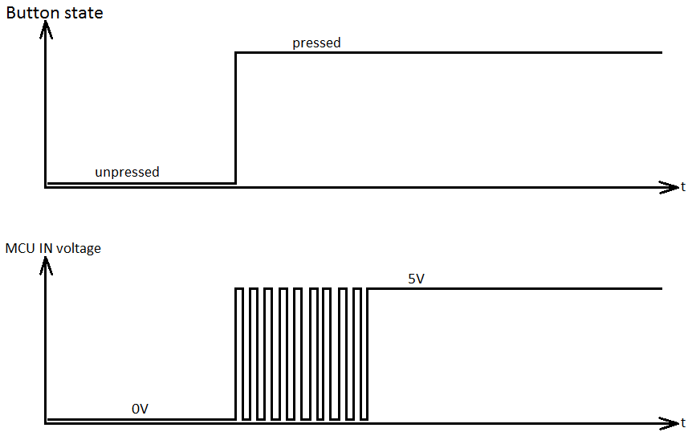

# Matrix scanning

Modules:

* [matrix.h](https://github.com/DavsX/dalsik/blob/master/matrix.h)
* [matrix.ino](https://github.com/DavsX/dalsik/blob/master/matrix.ino)


In the [Keyboard wiring](keyboard_wiring.md) document we saw how each key is wired up to the microcontroller. Scanning the keyboard matrix means checking the state (pressed or released) of each key and finding those, whose state has changes. This is the main thing each half is doing.

For tracking the state of each key I am using an array `uint8_t keystate[ROW_PIN_COUNT][ONE_SIDE_PIN_COUNT]` in [matrix.h](https://github.com/DavsX/dalsik/blob/master/matrix.h). The value of `0` means, that a key is released, while `1` is for pressed keys.

## Pin initialization

The pin-to-row mapping is defined in [dalsik.h](https://github.com/DavsX/dalsik/blob/master/dalsik.h) like this:

```c++
// dalsik.h
const uint8_t ROW_PINS[ROW_PIN_COUNT] = {
    PIN_D(7), PIN_E(6), PIN_B(4), PIN_B(5)
};
const uint8_t COL_PINS[ONE_SIDE_COL_PIN_COUNT] = {
    PIN_F(6), PIN_F(7), PIN_B(1), PIN_B(3), PIN_B(2), PIN_B(6)
};
```

Each pin is initialized in the `Matrix::Matrix()` constructor:

```c++
// matrix.ino
for (uint8_t row = 0; row < ROW_PIN_COUNT; row++) {
    PinUtils::pinmode_input_pullup(ROW_PINS[row]);
}
for (uint8_t col = 0; col < ONE_SIDE_COL_PIN_COUNT; col++) {
    PinUtils::pinmode_input_pullup(COL_PINS[col]);
}
```

Why are row pins initialized as input_pullup instead of output_high? Why are they then switched to output_low and back to input_pullup? According to [arduino.cc](https://www.arduino.cc/en/Tutorial/Foundations/DigitalPins) it is safer to keep those pins idle as input_pullup, because they provide less current as output_high, so there is less chance of damaging a pin in case of creating a short circuit.

## Scanning



Scanning is implemented in `Matrix::scan()`. In it we loop through each row and we check each column. The pins are all set to the _high_ signal (pull-up) - so reading from each column pin in idle mode returns `1`. 

We set each row pin to _low_ signal (`PinUtils::pinmode_output_low`) and for each row we read each column pin one by one.

* If the key for that row and column is not pressed, then we read a high signal for that pin (because of the pull-up resistor).
* If the key for that row and columns is pressed, then the pull-up high signal of the column's pin is connected to the ground (to the row's pin) and because of that we read a low signal.

After checking each column we set the row's pin back to `pinmode_input_pullup` and proceed to the next row. The `Matrix::scan()` function returns the first detected key change via the `ChangedKeyCoords` struct:

```c++
// matrix.h
typedef struct {
    uint8_t type;
    uint8_t row;
    uint8_t col;
} ChangedKeyCoords;
```

The type of the change can be:

```c++
// matrix.h
#define EVENT_NONE 0x00
#define EVENT_KEY_PRESS 0x01
#define EVENT_KEY_RELEASE 0x02
```

The column's state is read by inverting the signal on the pin:

```c++
// matrix.ino
uint8_t input = !PinUtils::read_pin(COL_PINS[col]);
uint8_t debounced_input = this->debounce_input(row, col, input);

if (debounced_input == DEBOUNCE_CHANGING) {
    continue; // Wait, till the value stabilizes
}

if (debounced_input != this->keystate[row][col]) {
    this->keystate[row][col] = debounced_input;
    PinUtils::pinmode_input_pullup(ROW_PINS[row]);

    if (debounced_input == DEBOUNCE_MAX) {
        return ChangedKeyCoords { EVENT_KEY_PRESS, row, col };
    } else {
        return ChangedKeyCoords { EVENT_KEY_RELEASE, row, col };
    }
}
```

After that we check the previous state of the key and if it's different, then we update the keystate to the current value and return a `ChangedKeyCoords` struct.

## Debouncing



When we press a key, the two metal electrodes don't instantly form a connection, but they bounce a bit (between connected and disconnected state). Without debouncing we could interpret a single key press as several press and release events, which is bad for a keyboard (If I press a button once, I expect the keyboard to send a single press event).

There are multiple ways of debouncing an input. One could for example implement it using `read -> sleep -> read` (and comparing the two values before and after). In Dalsik I use a separate, 6-step debounce array (each key has it's own debounce value).

It works like this:

* the value in the `debounce` array is always between `DEBOUNCE_MIN` (0) and `DEBOUNCE_MAX` (5)
* during scanning each value for the key is decremented/incremented based on the pin state
* if the `debounce` value is `DEBOUNCE_LOW`, then the key is considered released
* if the `debounce` value is `DEBOUNCE_MAX`, then the key is considered pressed
* if the `debounce` value is between `DEBOUNCE_LOW` and `DEBOUNCE_MAX`, then the key is considered to be in it's previous state (`DEBOUNCE_CHANGING` state)

```c++
uint8_t Matrix::debounce_input(uint8_t row, uint8_t col, uint8_t input) {
    if (input) {
        if (this->debounce[row][col] < DEBOUNCE_MAX) {
            this->debounce[row][col]++;
        }
        if (this->debounce[row][col] == DEBOUNCE_MAX) {
            return DEBOUNCE_MAX;
        }
    } else {
        if (this->debounce[row][col] > DEBOUNCE_MIN) {
            this->debounce[row][col]--;
        }
        if (this->debounce[row][col] == DEBOUNCE_MIN) {
            return DEBOUNCE_MIN;
        }
    }
    return DEBOUNCE_CHANGING;
}
```

