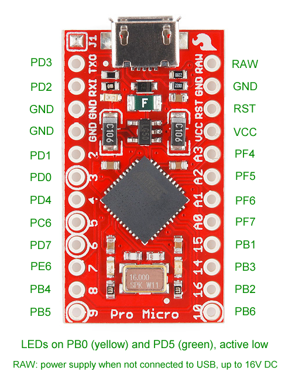
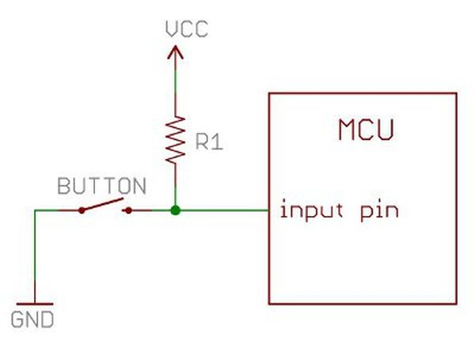

# Microcontroller Basics

The heart of the keyboard is the 8-bit AVR Pro Micro (atmega32u4) microcontroller (MCU) on each side of the keyboard. One of the Pro Micro's is powered via the USB cable and this microcontroller powers the other side via the TRRS cable.



## Main parameters

* 16MHz processor
* Flash Program Memory: 32kB (for the code)
* EEPROM: 1kB (keymap and other static configuration is stored here. The memory is non-volatile, which means that it remembers its data even if powered off. The trade-offs are slower writing speed and limited number of writes - wear-off)
* SRAM: 2.5kB (for the variables. This memory is volatile, which means that all the data is lost when the device is powered off)
* Hardware USB support (no need to emulate it in software)

## Flashing the Pro Micro

Flashing is done by compiling the C++ code and uploading it into the microcontroller's Flash memory. The Pro Micro has a bootloader, which supports flashing directly via the USB cable (no need to reset the MCU manually using the RST pin), which makes the whole process very easy.

For flashing the Pro Micro I use the [Arduino IDE](https://www.arduino.cc/en/software). It has a GUI interface for editing / flashing the code, but I don't use it. For code editing I use Vim and for flashing I use the command-line interface of the IDE.

```makefile
// Makefile
upload:
	arduino --board sparkfun:avr:promicro:cpu=16MHzatmega32U4 --upload dalsik.ino --verbose --port /dev/ttyACM0

verify:
	arduino --board sparkfun:avr:promicro:cpu=16MHzatmega32U4 --verify dalsik.ino --verbose --port /dev/ttyACM0
```


## I/O

The Pro Micro has multiple pins, which can be used for input and output. The module PinUtils ( [pin_utils.h](https://github.com/DavsX/dalsik/blob/master/pin_utils.h),  [pin_utils.ino](https://github.com/DavsX/dalsik/blob/master/pin_utils.ino) ) provides constants and helper functions for setting up pins for input/output and for reading/writing. A pin always needs to be configured first for input or output and after we can read/write from/to that pin.

Pin I/O is used for determining key events and also during communication between the master and slave halves.

### Using a pin as input

When we configure a pin as input, it is by default connected via a pull-up resistor (R1) to Vcc, so that the pin's state is not _floating_. That means, that the default value of the pin is _high_. To change the state of the pin, we must connect it to ground. Therefore we must invert the signal read from the pin in code, as the signal _high_ represents the logical "0".

Using a pull-down resistor would also work, but the atmega32u4 MCU has internal pull-up resistors, so that we don't need to use any additional hardware.



```c++
#include "pin_utils.h"

uint8_t pin = PIN_B(4);

PinUtils::pinmode_input_pullup(pin); // Setup

uint8_t value = PinUtils::read_pin(pin)
```


### Using a pin as output

In output mode we can set the pin's output value to the _low_ or _high_ electric signal ("0V" and "5V"). When connected (with a cable) with an input pin with a pullup resistor, setting the output pins value to _low_ changes the value read from the input pin to _low_ as well.

```c++
#include "pin_utils.h"

uint8_t pin = PIN_B(4);

PinUtils::pinmode_output_low(pin); // Setup + initial "low" value
PinUtils::pinmode_output_high(pin); // Setup + initial "high" value

PinUtils::set_output_low(pin);
PinUtils::set_output_high(pin);
```

## Memory mapped IO

Configuring/reading/writing pins is done by writing to special addresses in RAM, which are defined in [iom32u4.h](https://github.com/vancegroup-mirrors/avr-libc/blob/master/avr-libc/include/avr/iom32u4.h) . The base addresses of various ports are also defined in `pin_utils.h`:

```c++
// pin_utils.h

#define PIN_B(x) (0x30+x)
#define PIN_C(x) (0x60+x)
#define PIN_D(x) (0x90+x)
#define PIN_E(x) (0xC0+x)
#define PIN_F(x) (0xF0+x)
```

Each port controls multiple pins, for example `PIN_B(1), PIN_C(2)` etc.

There are 3 types of registers, that allow us to manipulate ports:

* DDRx
  * Data Direction Register (RW)
  * Bit "0" sets a pin to input mode, bit "1" to output mode
* PORTx
  * Pin Output Register (RW)
  * Does different things based on the pin DDRx mode:
    * input
      * Bit "0" sets the pin to "floating", big "1" activates the pull-up resistor
    * output
      * Big "0" sets the pin's output to _low_, "1" to _high_
* PINx
  * Pin Input Register (RO)
  * This register can be used to read from pins (that are set to input mode). The value of "0" means _low_, "1" means _high_

## Setup and main loop

When compiling a project for a microcontroller with the Arduino IDE, we have to provide two functions:

* `void setup()` - this function is run only once at the beginning
* `void loop()` - this function is called, well, in a loop

The main function provided by Arduino is basically this:

```c++
void main() {
    setup();
    while(1) {
        loop();
    }
}
```

